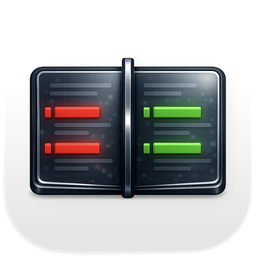

<p align="center">
  
</p>

# differ

Type in either side, see instant green/red diffs with syntax highlighting and auto language detection. Native macOS shell via [Tauri 2](https://v2.tauri.app/), diff UI via [`@codemirror/merge`](https://codemirror.net/docs/ref/#merge).

## Prerequisites

- macOS 14+
- [bun](https://bun.sh) — `curl -fsSL https://bun.sh/install | bash`
- Rust (stable, 1.77+) — `curl --proto '=https' --tlsv1.2 -sSf https://sh.rustup.rs | sh`
- Xcode Command Line Tools — `xcode-select --install`

## Run it

```sh
bun install
bun tauri dev
```

First run compiles the Rust side and takes a few minutes. Subsequent runs are fast.

## Build a release app

```sh
bun tauri build
```

Produces `src-tauri/target/release/bundle/macos/differ.app` and a `.dmg`.

## Keyboard shortcuts

| Shortcut | Action |
|----------|--------|
| `⌘H` | Toggle history drawer |
| `⌘⇧S` | Swap sides |
| `⌘⇧N` | Force a new history entry (bypass dedupe) |
| `⌘⇧⌫` | Clear both editors |
| `⌘F` | Search within focused pane |
| `⌘Z / ⌘⇧Z` | Undo / redo |

## Where things live

| | |
|---|---|
| Editors, merge view, language detection | [src/merge/](src/merge/) |
| State signals | [src/state.ts](src/state.ts) |
| Toolbar, shortcuts, toast | [src/chrome/](src/chrome/) |
| Light/dark CodeMirror themes | [src/theme/](src/theme/) |
| History UI + IPC client | [src/history/](src/history/) |
| Rust history store + dedupe | [src-tauri/src/](src-tauri/src/) |
| Persisted history JSON | `~/Library/Application Support/com.boubcherissam.differ/history.json` |

## Architecture notes

- **State**: `@preact/signals-core` signals in [src/state.ts](src/state.ts) are the single source of truth. CodeMirror writes on doc change; effects observe and fan out.
- **Diff**: `@codemirror/merge`'s `MergeView` recomputes chunks on each keystroke automatically — no debounce needed for the diff itself.
- **Language detection**: [src/merge/languageDetect.ts](src/merge/languageDetect.ts) — heuristic (shebang → fast-wins → weighted keyword score). Manual override via toolbar dropdown; picking "Auto" re-enables detection.
- **Grammar loading**: lazy via `@codemirror/language-data` — grammar for the detected/selected language is imported on demand.
- **History**: Rust side owns `history.json`. Frontend debounces 2.5s after last edit and calls `invoke('history_capture', ...)`. Dedupe decides append-vs-update in [src-tauri/src/dedupe.rs](src-tauri/src/dedupe.rs) using prefix/suffix hash + Levenshtein on a 1 KB suffix with a 10-minute cutoff.
- **Chrome**: transparent Tauri window + CSS `backdrop-filter` for a faux-glass titlebar/drawer. `data-tauri-drag-region` makes the top strip draggable.

## Icons (for release bundles)

Bundled platform icons live in [`src-tauri/icons/`](src-tauri/icons/). Regenerate from the 1024×1024 master after editing it:

```sh
bun tauri icon src-tauri/icons/app-icon-source-1024.png
```

The in-app About screen and [`public/app-icon.png`](public/app-icon.png) (README hero) use a 256×256 export; after regenerating icons, refresh that file if the artwork changed:

```sh
cp src-tauri/icons/128x128@2x.png public/app-icon.png
```

## Sandbox / network

The frontend CSP disallows remote origins. Tauri's IPC is the only non-self connection. Verify with `nettop -p differ` — zero outbound traffic during normal use.
